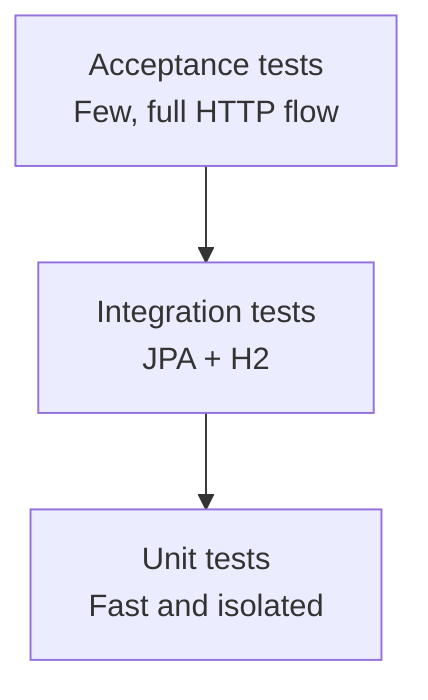

# Challenge Service

REST API that returns the price applicable to a product, brand, and date.

The project was built as a technical challenge with a strong focus on:

- clear business rules;
- API First development;
- hexagonal architecture;
- automated testing at different levels;
- reproducible local execution;
- objective quality checks;
- concise but complete documentation.

---

## Contents

- [Overview](#overview)
- [Quick start](#quick-start)
- [API](#api)
- [Business rules](#business-rules)
- [Architecture](#architecture)
- [Project structure](#project-structure)
- [Technical decisions and trade-offs](#technical-decisions-and-trade-offs)
- [Persistence and datasets](#persistence-and-datasets)
- [Testing strategy](#testing-strategy)
- [Architecture and coverage checks](#architecture-and-coverage-checks)
- [Docker, health monitoring, and local tools](#docker-health-monitoring-and-local-tools)
- [Postman](#postman)
- [Development workflow](#development-workflow)
- [Production considerations](#production-considerations)

---

## Overview

The service receives three mandatory query parameters:

- date;
- product identifier;
- brand identifier.

It returns the valid price with the highest priority.

### Technology stack

| Technology | Purpose |
|---|---|
| Java 21 | Language and runtime |
| Spring Boot | Application bootstrap and dependency management |
| Spring MVC | REST API |
| OpenAPI Generator | API First interface and model generation |
| Springdoc | Swagger UI and OpenAPI documentation |
| Spring Data JPA / Hibernate | Persistence |
| H2 | In-memory database for local execution and tests |
| MapStruct | Compile-time mapping |
| Lombok | Limited JPA entity boilerplate reduction |
| JUnit 5 / Mockito / AssertJ | Automated testing |
| ArchUnit | Architectural rule enforcement |
| JaCoCo | Coverage reporting and quality gate |
| Spring Boot Actuator | Health endpoint |
| Docker / Docker Compose | Reproducible execution |
| Postman | Manual and scripted API verification |

---

## Quick start

### Requirements

The required tools depend on how the application is executed.

#### Local execution

- Java 21
- Git

A local Maven installation is not required because the project includes Maven Wrapper.

#### Docker execution

- Docker
- Docker Compose

Java does not need to be installed on the host when using Docker Compose. The application is compiled and executed with Java 21 inside the Docker images defined by the project.


### Run locally


Verify the project and start the application:

```bash
./mvnw clean verify
./mvnw spring-boot:run
```

### Run with Docker Compose

Build and start the application in the background:

```bash
docker compose up --build -d
```

Check the container status:

```bash
docker compose ps
```

Expected container state:

```text
healthy
```

Stop the environment with:

```bash
docker compose down
```

### Application URL

Regardless of whether the application is started locally or with Docker Compose, it is available at:

```text
http://localhost:8080
```

---

## API

The project follows an **API First** approach. The OpenAPI document defines the endpoint, parameters, schemas, validation constraints, response codes, and representative examples.

### Endpoint

```http
GET /api/v1/prices
```

### Query parameters

| Parameter | Type | Required | Example |
|---|---|---:|---|
| `date` | string | Yes | `2020-06-14-16.00.00` |
| `productId` | integer | Yes | `35455` |
| `brandId` | integer | Yes | `1` |

The three parameters are used together:

```text
date + productId + brandId
```

Partial searches are outside the scope of the challenge.

### Date format

```text
yyyy-MM-dd-HH.mm.ss
```

Example:

```text
2020-06-14-16.00.00
```

The format does not include a time zone or UTC offset. The application therefore uses `LocalDateTime` and performs no time-zone conversion.

### Example request

```bash
curl --get \
  'http://localhost:8080/api/v1/prices' \
  --data-urlencode 'date=2020-06-14-16.00.00' \
  --data-urlencode 'productId=35455' \
  --data-urlencode 'brandId=1' \
  -H 'Accept: application/json'
```

### Example response

```json
{
  "productId": 35455,
  "brandId": 1,
  "priceList": 2,
  "startDate": "2020-06-14-15.00.00",
  "endDate": "2020-06-14-18.30.00",
  "price": 25.45,
  "currency": "EUR"
}
```

### Response codes

| Status | Meaning | Error code |
|---:|---|---|
| `200` | Applicable price found | — |
| `400` | Missing or invalid request parameter | `INVALID_REQUEST` |
| `404` | No applicable price found | `PRICE_NOT_FOUND` |
| `500` | Unexpected internal error | `INTERNAL_SERVER_ERROR` |

The OpenAPI contract includes specific examples for successful and error responses so that Swagger UI shows realistic payloads for each status code.

---

## Business rules

A price is applicable when:

1. `productId` matches the requested product.
2. `brandId` matches the requested brand.
3. The requested date is inside the validity period.
4. If several prices are applicable, the highest numerical priority wins.

The date range is inclusive:

```text
startDate <= requestedDate <= endDate
```

## Architecture

The solution follows **hexagonal architecture**.

```mermaid
flowchart LR
    Client[HTTP Client]
    Rest[REST Adapter]
    UseCase[Input Port / Use Case]
    Service[Application Service]
    OutputPort[Output Port]
    Persistence[Persistence Adapter]
    Repository[JPA Repository]
    Database[(H2)]

    Client --> Rest
    Rest --> UseCase
    UseCase --> Service
    Service --> OutputPort
    OutputPort --> Persistence
    Persistence --> Repository
    Repository --> Database
```



### Dependency direction

The core defines the contracts. Infrastructure implements them.

```text
Application defines the port
Infrastructure implements the port
```

The application and domain layers do not depend on REST, JPA, H2, MapStruct, or Spring MVC.

### Naming convention

The project uses the following convention:

```text
UseCase = capability offered by the application
Port    = dependency required by the application
```

This is a readability decision, not a mandatory rule of hexagonal architecture.

### Adapter direction

```text
adapter/in  -> receives external calls
adapter/out -> connects the application to external dependencies
```

The REST adapter never accesses the repository directly. The expected flow is:

```text
REST adapter
  -> input port
  -> application service
  -> output port
  -> persistence adapter
```

---

## Project structure

Simplified structure:

```text
com.jpau.challenge
├── domain
│   └── model
├── application
│   ├── exception
│   ├── port
│   │   ├── in
│   │   └── out
│   └── service
└── infrastructure
    ├── adapter
    │   ├── in
    │   │   └── rest
    │   │       ├── exception
    │   │       └── mapper
    │   └── out
    │       └── persistence
    │           ├── entity
    │           ├── mapper
    │           └── repository
    └── configuration
```

---

## Technical decisions and trade-offs

The implementation deliberately prioritizes **clarity, testability, and explicit boundaries** over adding the largest possible number of technologies.

Each relevant choice is documented below.

### API First instead of implementation-first

**Decision.** The OpenAPI document is the source of truth for the endpoint, parameters, schemas, validation constraints, response codes, and examples.

It generates:

- the interface implemented by the REST adapter;
- request and response models;
- validation annotations;
- Swagger documentation metadata.

**Rationale.** Defining the contract before the implementation makes the external behavior explicit and reduces drift between documentation and code.

**Trade-off.** Generated sources are build output. They must not be edited manually, and generator configuration becomes part of the project design.

### Hexagonal architecture for dependency control

**Decision.** The project separates domain, application, and infrastructure. Input and output ports are defined by the application core, while infrastructure provides the adapters.

```text
REST adapter
  -> input port
  -> application service
  -> output port
  -> persistence adapter
```

**Rationale.** The application flow and business boundaries can be understood and tested independently from Spring MVC, JPA, H2, or HTTP models. Persistence-specific selection behavior is verified separately through integration tests.

**Trade-off.** This introduces interfaces and mapping classes that would be unnecessary in a very small CRUD-only application. They are accepted here because they make the dependency direction and the business boundary explicit.

The naming convention is:

```text
UseCase = capability offered by the application
Port    = dependency required by the application
```

This is a project convention for readability, not a requirement of hexagonal architecture.

### Framework-independent application service

**Decision.** The application service is not annotated with `@Service`. It is registered through an infrastructure configuration class.

**Rationale.** The use case remains ordinary Java code and does not depend on Spring.

**Trade-off.** Bean creation must be configured explicitly instead of relying on component scanning.

### Applicable price selection at persistence level

**Decision.** Persistence selects the applicable price directly.

The query:

```text
1. filters by product and brand;
2. applies the inclusive validity range;
3. orders matching prices by priority descending;
4. limits the result to one row.
```

The output port therefore returns an `Optional<Price>` containing at most one applicable price.

**Rationale.** All the information required to identify the applicable price is available to the database. Ordering and limiting the result at persistence level avoids loading several matching rows into application memory only to discard all but the highest-priority one.

The application service remains responsible for the use-case behavior, including translating the absence of an applicable price into the corresponding business exception.

**Trade-off.** The priority rule is less explicit in the application service because part of the selection behavior is implemented by the persistence query. This is accepted because the rule maps naturally to database filtering and ordering and can be verified through persistence integration tests.

### `LocalDateTime` and the required input format

**Decision.** The API accepts:

```text
yyyy-MM-dd-HH.mm.ss
```

and represents it with `LocalDateTime`.

**Rationale.** The challenge format contains neither a time zone nor an offset, so the application compares the exact local date and time supplied by the client without inventing a conversion rule.

**Trade-off.** This is intentionally limited. A production API used across time zones should prefer UTC with `Instant`, or an explicit offset with `OffsetDateTime`.

### Immutable domain model and separate persistence entity

**Decision.** The domain price is represented as an immutable Java `record`, while persistence uses a regular JPA entity.

**Rationale.** The domain model should express business data without JPA lifecycle or construction constraints. The persistence entity can then satisfy Hibernate requirements independently.

The entity uses Lombok selectively:

```java
@Getter
@NoArgsConstructor(access = AccessLevel.PROTECTED)
```

`@Data` and public setters are intentionally avoided.

**Trade-off.** Domain and persistence models must be mapped. This is accepted to prevent JPA entities from leaking into the application core.

### Explicit mapping boundaries

**Decision.** MapStruct performs compile-time mapping at infrastructure boundaries:

```text
PriceEntity -> Price
Price       -> API response
```

**Rationale.** The application does not depend on JPA entities or generated API DTOs, and mapping errors can be detected during compilation.

**Trade-off.** Additional mapper interfaces are required. Null-handling branches generated by MapStruct may also appear in coverage reports even when null is not a valid business input.

### Monetary values use `BigDecimal`

**Decision.** Prices use `BigDecimal` rather than `double` or `float`.

**Rationale.** Monetary values require decimal precision and should not depend on binary floating-point representation.

**Trade-off.** Arithmetic and comparisons are slightly more verbose, but correctness is more important than convenience for pricing data.

### Centralized and stable error responses

**Decision.** A global exception handler translates validation, business, and unexpected failures into one error schema:

```json
{
  "code": "INVALID_REQUEST",
  "message": "One or more request parameters are missing or invalid",
  "timestamp": "2026-08-04T17:00:00Z",
  "path": "/api/v1/prices"
}
```

**Rationale.** Centralizing exception translation keeps the REST adapter focused on request handling, use-case invocation, and response mapping. It also provides clients with a predictable and consistent error contract.

**Trade-off.** Spring MVC can raise several exception types for invalid parameters, so they must be handled explicitly. Unexpected exception details are logged server-side but deliberately not exposed to clients.

### Isolated datasets by test responsibility

**Decision.** Normal execution data and test fixtures are separated.

```text
src/main/resources/db/data.sql
src/test/resources/db/
```

Tests disable normal initialization with:

```text
spring.sql.init.mode=never
```

and load their own fixtures with `@Sql`.

**Rationale.** Persistence and acceptance tests become deterministic and do not pass accidentally because of demonstration data.

**Trade-off.** More SQL files must be maintained, but each suite owns the data needed for its purpose.

### Tests are separated by the question they answer

**Decision.** The project uses several test levels rather than repeating the same check everywhere.

```text
Unit tests        -> Does the use case handle persistence results correctly?
Integration tests -> Does persistence select the correct applicable price?
Acceptance tests  -> Does the public API behave correctly end to end?
ArchUnit tests    -> Are architectural boundaries still respected?
```

**Rationale.** Each test type protects a different risk and keeps failures easier to diagnose.

**Trade-off.** The suite takes longer than unit tests alone. For this challenge all tests remain under Surefire to keep Maven configuration simple.

### Architecture is enforced with ArchUnit

**Decision.** Architectural rules are executable tests.

They verify, among other constraints, that:

- domain does not depend on application or infrastructure;
- application does not depend on infrastructure;
- the core remains independent from frameworks;
- inbound adapters do not access outbound adapters directly;
- architectural packages are free of cycles;
- input and output ports follow the naming convention.

**Rationale.** The architecture is not only described in this README; the build fails if an implementation change violates it.

**Trade-off.** Rules must be reviewed when a legitimate architectural evolution occurs. They should protect meaningful boundaries, not arbitrary package aesthetics.

### Coverage measures manually implemented behavior

**Decision.** JaCoCo excludes OpenAPI-generated models and enforces quality gates on the relevant code.

Quality gates:

```text
Line coverage   >= 90 %
Branch coverage >= 50 %
```

**Rationale.** Generated getters, setters, utility methods, and validation helpers do not represent implementation decisions made in this project. Excluding them produces a more meaningful signal.

**Trade-off.** The exclusion must be documented transparently. Coverage is treated as supporting evidence, not as a substitute for meaningful tests.

### Minimal health exposure

**Decision.** Spring Boot Actuator exposes only:

```text
GET /actuator/health
```

Docker Compose uses it to distinguish a running container from a healthy application.

**Rationale.** Local orchestration can verify readiness without exposing internal operational details.

**Trade-off.** Other actuator endpoints and detailed health information are intentionally unavailable. A production environment would normally place management endpoints behind authentication and dedicated operational controls.

### Reproducible and safer container execution

**Decision.** The Dockerfile uses a multi-stage Java 21 build, packages only the final JAR in the runtime image, and runs the application as a non-root user.

**Rationale.** The application can be built and started consistently without relying on the host machine configuration, while reducing unnecessary runtime privileges.

**Trade-off.** The Dockerfile is more detailed than a single-stage image, and the healthcheck requires a small HTTP client inside the runtime image.

### Deliberately deferred decisions

Some valid improvements were considered but left outside this iteration:

- **GitHub Actions:** useful for automatic verification, but deferred to avoid expanding delivery scope.
- **Maven Failsafe:** useful for separating slower integration and acceptance stages in a larger CI/CD pipeline; Surefire is sufficient for this challenge.
- **PostgreSQL and Testcontainers:** valuable when production uses PostgreSQL, but H2 is explicitly suitable for this challenge and keeps execution lightweight.
- **Full Actuator exposure:** deliberately avoided to reduce information exposure.
- **Kubernetes or additional infrastructure:** would add technology without improving the core challenge evaluation.

The goal is to demonstrate engineering judgement, including knowing when **not** to add complexity.

---

## Persistence and datasets

The persistence query selects the applicable price using:

```text
productId
brandId
startDate <= requestedDate
endDate >= requestedDate
ORDER BY priority DESC
LIMIT 1
```

The validity interval is inclusive.

When several prices are applicable for the same product, brand, and date, the database orders them by priority in descending order and returns only the highest-priority one.

This avoids transferring and materializing rows that the application would immediately discard.

### Application dataset

The application loads the original challenge data from:

```text
src/main/resources/db/data.sql
```

### Test datasets

Tests use controlled SQL datasets under:

```text
src/test/resources/db/
```

Normal application initialization is disabled during database and acceptance tests:

```text
spring.sql.init.mode=never
```

Datasets are then loaded explicitly with `@Sql`.

This separation prevents tests from depending accidentally on demonstration data.

---

## Testing strategy

The project follows the testing pyramid.



### Unit tests

Scope:

```text
application service + mocked output port
```

They validate:

- successful return of the price provided by the output port;
- not-found behavior when persistence returns no applicable price;
- application behavior without Spring or a database.

### Persistence integration tests

Scope:

```text
persistence adapter -> repository -> Hibernate -> H2
```

They use:

- `@DataJpaTest`;
- real JPA/Hibernate queries;
- real mappings;
- controlled SQL data;
- no repository mocks.

They validate:

- filtering by product and brand;
- inclusive validity date boundaries;
- highest-priority selection when several prices are applicable;
- empty results when no applicable price exists.

### API acceptance tests

Scope:

```text
real HTTP
  -> REST adapter
  -> use case
  -> persistence adapter
  -> H2
```

They use:

- `@SpringBootTest(webEnvironment = RANDOM_PORT)`;
- real serialization and validation;
- no mocks;
- the five required challenge scenarios;
- representative `400` and `404` cases.

### Running tests

All tests:

```bash
./mvnw clean test
```

Complete verification:

```bash
./mvnw clean verify
```

Specific class:

```bash
./mvnw test -Dtest=FindPriceServiceTest
./mvnw test -Dtest=PricePersistenceAdapterIntegrationTest
./mvnw test -Dtest=PriceApiAcceptanceTest
./mvnw test -Dtest=PriceRestAdapterTest
```

The current project intentionally keeps all tests under Maven Surefire for simplicity.

A larger project could introduce Maven Failsafe to separate unit, integration, and acceptance stages in CI/CD.

---

## Architecture and coverage checks

The architectural and coverage decisions are explained in
[Technical decisions and trade-offs](#technical-decisions-and-trade-offs).

### ArchUnit

Run the architecture rules with:

```bash
./mvnw test -Dtest=ArchitectureTest
```

Any forbidden dependency or architectural cycle makes the test fail.

### JaCoCo

Generate the report and execute the quality gate with:

```bash
./mvnw clean verify
```

HTML report:

```text
target/site/jacoco/index.html
```

OpenAPI-generated models are excluded from the measured code.

---

## Docker, health monitoring, and local tools

### Docker image

The Dockerfile uses a multi-stage build:

1. Java 21 JDK compiles and packages the application.
2. Java 21 runtime executes only the final JAR.
3. The application runs as a non-root user.

Tests are executed before building the image:

```bash
./mvnw clean verify
docker compose up --build
```

### Health endpoint

Spring Boot Actuator exposes only:

```text
GET /actuator/health
```

Response:

```json
{
  group: [
    "liveness",
    "readiness"
  ],
  status: "UP"
}
```

Health details are intentionally hidden.

Other actuator endpoints are not exposed.

### Docker healthcheck

Docker Compose checks the actuator endpoint from inside the container.

This distinguishes:

```text
container running
```

from:

```text
application ready and healthy
```

Check the state with:

```bash
docker compose ps
```

Expected result:

```text
healthy
```

### Available local URLs

| Tool | URL |
|---|---|
| API | `http://localhost:8080/api/v1/prices` |
| Swagger UI | `http://localhost:8080/swagger-ui.html` |
| OpenAPI JSON | `http://localhost:8080/v3/api-docs` |
| H2 Console | `http://localhost:8080/h2-console` |
| Health | `http://localhost:8080/actuator/health` |

### H2 Console credentials

```text
Driver Class: org.h2.Driver
JDBC URL: jdbc:h2:mem:pricesdb;DB_CLOSE_DELAY=-1;DB_CLOSE_ON_EXIT=FALSE
User Name: sa
Password: empty
```

The H2 console requires remote web access when used from the host against the application running inside Docker.

That setting is enabled only in `compose.yaml` for local development:

```text
SPRING_H2_CONSOLE_SETTINGS_WEB_ALLOW_OTHERS=true
```

It is not enabled globally and should not be used in production.

---

## Postman

Collection:

```text
postman/challenge_collection.json
```

It contains:

- the five required successful scenarios;
- invalid date returning `400`;
- missing mandatory parameter returning `400`;
- unknown price returning `404`;
- automatic assertions for status, price list, price, currency, and error code.

Collection variables:

```text
baseUrl   = http://localhost:8080
productId = 35455
brandId   = 1
```

Start the service before running the collection:

```bash
docker compose up --build -d
```

---

## Development workflow

The work was planned before implementation using GitHub Issues and tracked on a GitHub Projects board, following a lightweight Jira-style workflow.

- [GitHub Project board](https://github.com/jpaucruz/inditex-tech-challenge/projects)
- [GitHub Issues](https://github.com/jpaucruz/inditex-tech-challenge/issues)

The workflow used:

- one issue per coherent task;
- issues defined before implementation;
- `Backlog`, `In Progress`, and `Done` board states;
- one or more branches per issue;
- pull requests that close their issue.

---

## Production considerations

This repository is intentionally scoped as a technical challenge. Before production use, the main points to revisit would be:

- replace `LocalDateTime` with UTC or an explicit offset;
- use an external database and versioned migrations;
- define a deterministic tie-break rule for equal priorities;
- expose only the required Actuator endpoints and restrict their access through authentication or network controls;
- disable the H2 Console entirely outside local development environments;
- separate test stages with Failsafe when pipeline duration justifies it;
- add CI automation and optional image publication.

These are documented as conscious scope boundaries rather than hidden limitations.